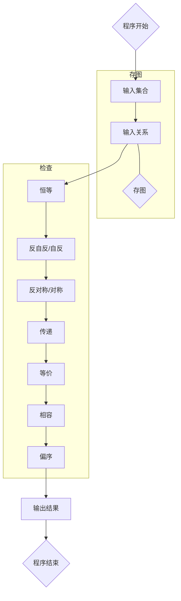
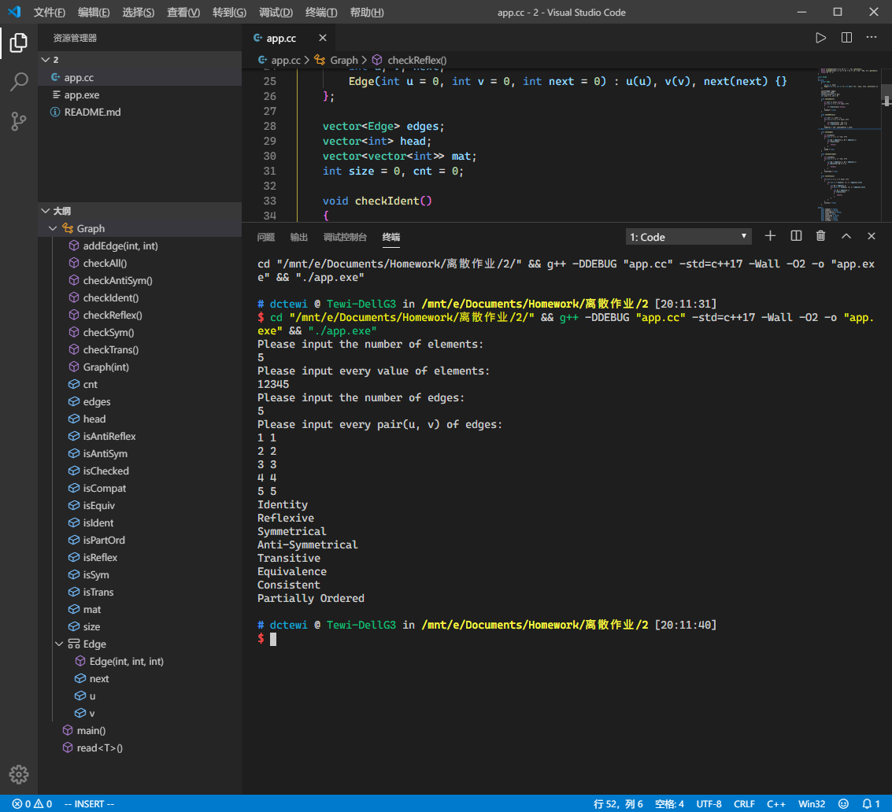
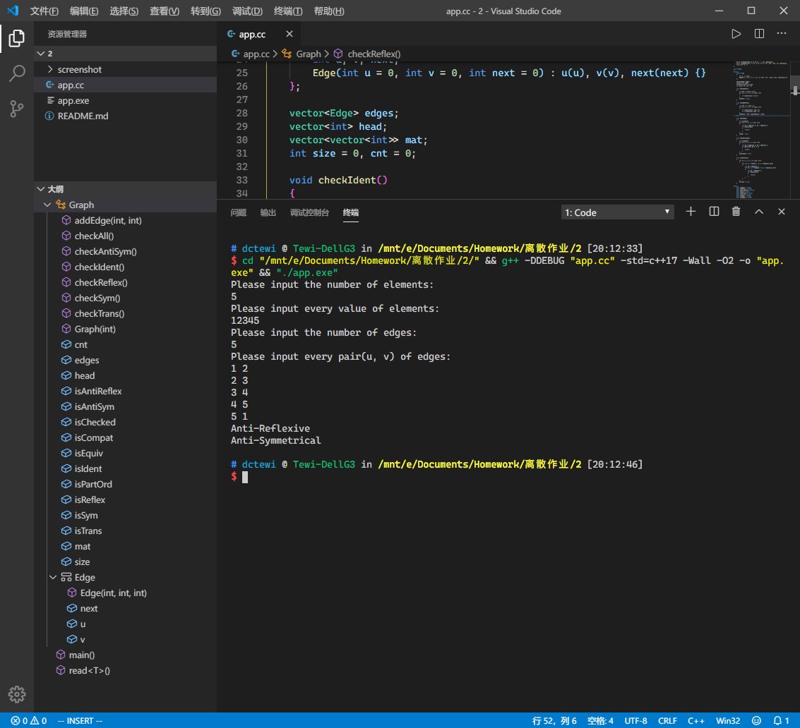
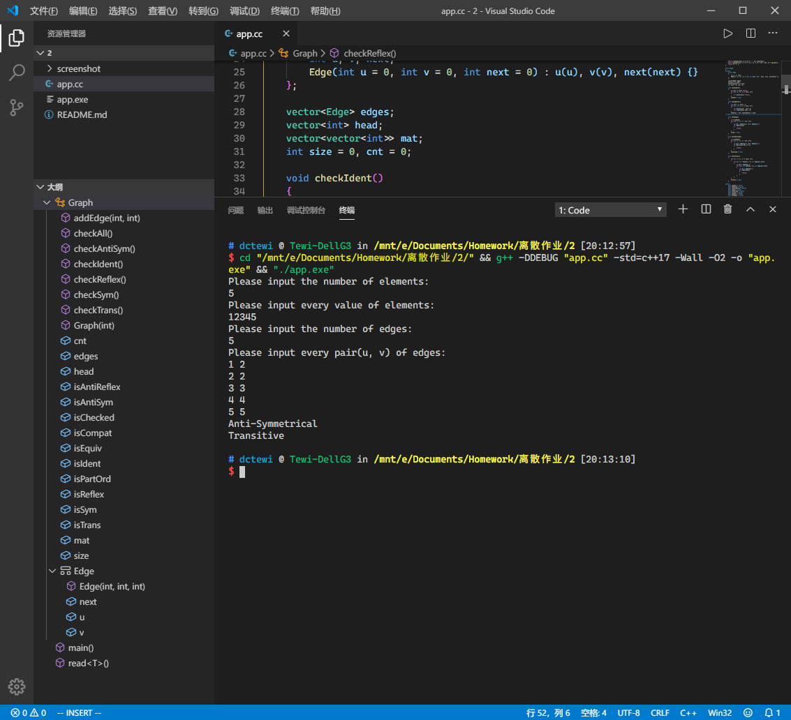

>姓名：冻葱Tewi
>
>学号：略
>
>邮箱：dctewi@stu.zzu.edu.cn dctewi@dctewi.com

# 集合的关系性质计算器

**使用语言：**

> C++ (C++17标准)

**测试环境：**

- g++ (Ubuntu 7.4.0-1ubuntu1~18.04.1) 7.4.0
- g++ (MinGW.org GCC-6.3.0-1) 6.3.0

**编译部署：**

```shell
g++ app.cc -std=c++17 -O2 -o app
./app
```

## 设计要求

输入一个集合，还有集合的一个关系。判断该关系是否是恒等、（反）自反、（反）对称、传递、等价、相容、偏序的。

## 设计思想

首先将整个集合抽象成一个点集，关系抽象成边集，那么整个广群就是一个图。再根据关系性质的判断条件判断关系是否是恒等、自反、对称、传递的。接着等价相容和偏序关系可以由已经求出的急中基础关系推断出。

在输入集合元素的过程中，可以由两个映射`std::map`来保存原元素的关系，并离散化到$[1,\ n]$中。并且图中同时由邻接矩阵和链式前向星存图，同时保证指定两点关系和遍历边时的效率。

存入图之后，先判断恒等关系和（反）自反关系，再判断对称和传递关系。其中如果没有恒等关系，则对称和反对称关系可以直接跳过来节省时间。接着，这些关系可以直接推测出等价、相容和偏序关系的判定情况。

## 流程图



## 输入输出截图







